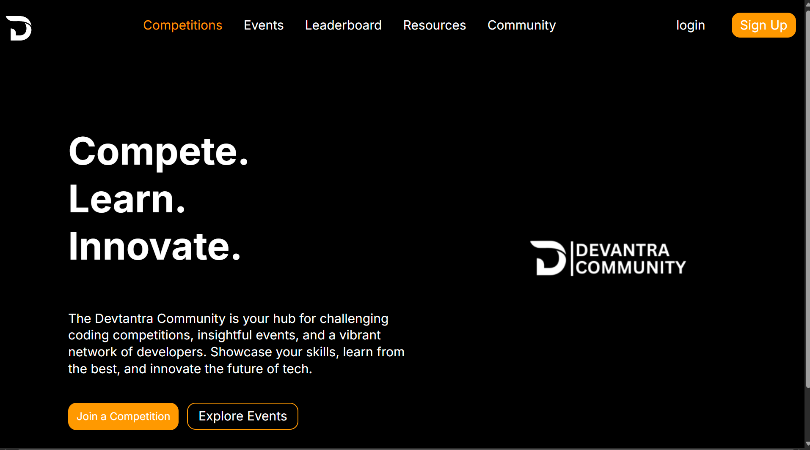

# React + Vite

This template provides a minimal setup to get React working in Vite with HMR and some ESLint rules.

Currently, two official plugins are available:

- [@vitejs/plugin-react](https://github.com/vitejs/vite-plugin-react/blob/main/packages/plugin-react) uses [Babel](https://babeljs.io/) for Fast Refresh
- [@vitejs/plugin-react-swc](https://github.com/vitejs/vite-plugin-react/blob/main/packages/plugin-react-swc) uses [SWC](https://swc.rs/) for Fast Refresh

## Expanding the ESLint configuration

If you are developing a production application, we recommend using TypeScript with type-aware lint rules enabled. Check out the [TS template](https://github.com/vitejs/vite/tree/main/packages/create-vite/template-react-ts) for information on how to integrate TypeScript and [`typescript-eslint`](https://typescript-eslint.io) in your project.

SETUP:

Community Website
Welcome to the project! This guide will walk you through the process of setting up the project environment and running it on your local machine.

Prerequisites
Before you begin, ensure you have the following installed on your system.

1. Node.js Installation
Node.js is required to run the project. If you don't have it installed, follow these steps:

Download Node.js: Go to the official Node.js website.

Select a Version: Download the LTS (Long-Term Support) version, which is recommended for most users.

Install: Run the installer and follow the on-screen instructions.

Verify Installation: Open your terminal or command prompt and run the following commands to check if Node.js and npm (Node Package Manager) were installed correctly:

node -v
npm -v

You should see the version numbers printed in the console.

Getting Started
Follow these steps to get your development environment set up.

2. Clone the Repository
Clone the project repository from GitHub to your local machine using the following command:

git clone https://github.com/SurajKumar-codes/Community-Page.git

After cloning, navigate into the project directory:

cd Community-Page

3. Install Dependencies
Once you are inside the project directory, install all the necessary project dependencies using npm:

npm install

This command will download all the packages and libraries listed in the package.json file into a node_modules folder.

4. Run the Development Server
Finally, you can start the local development server with this command:

npm run dev

This will launch the application in development mode. Open your web browser and navigate to http://localhost:5173 (or the URL specified in your terminal) to see the application running.

The server will automatically reload if you make any changes to the source files.

Happy coding!